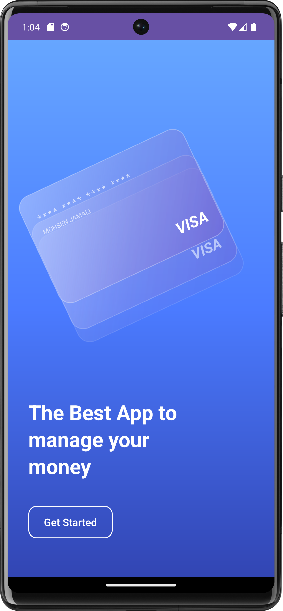
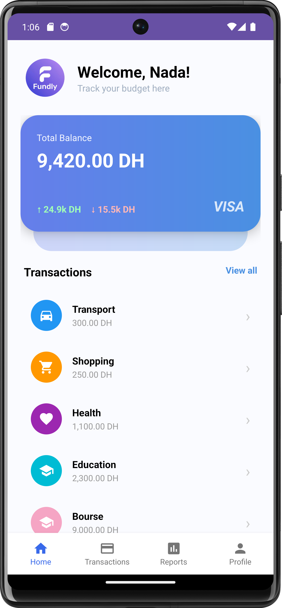
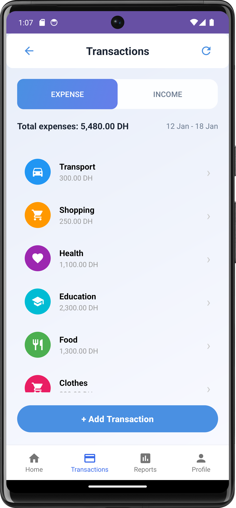
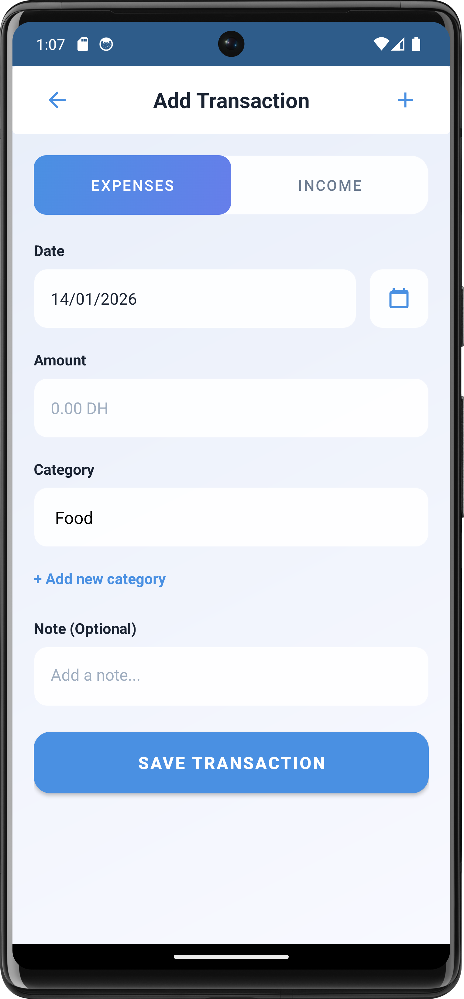
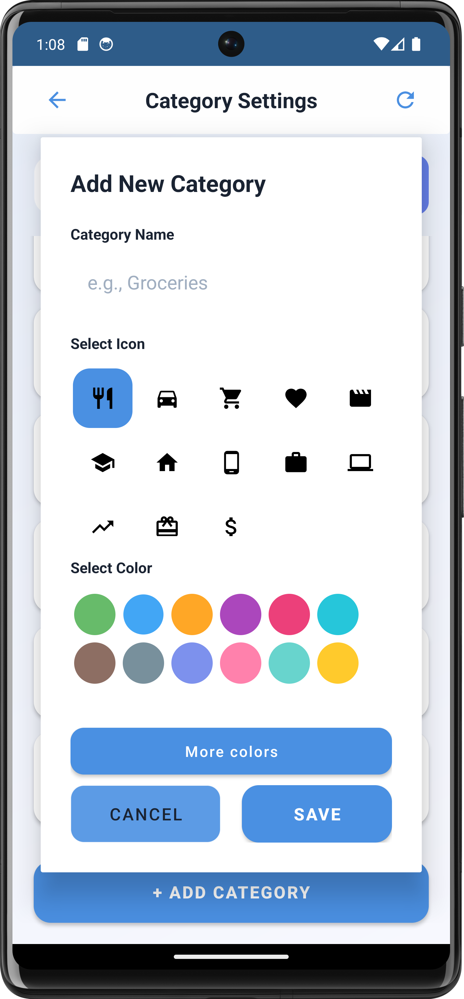
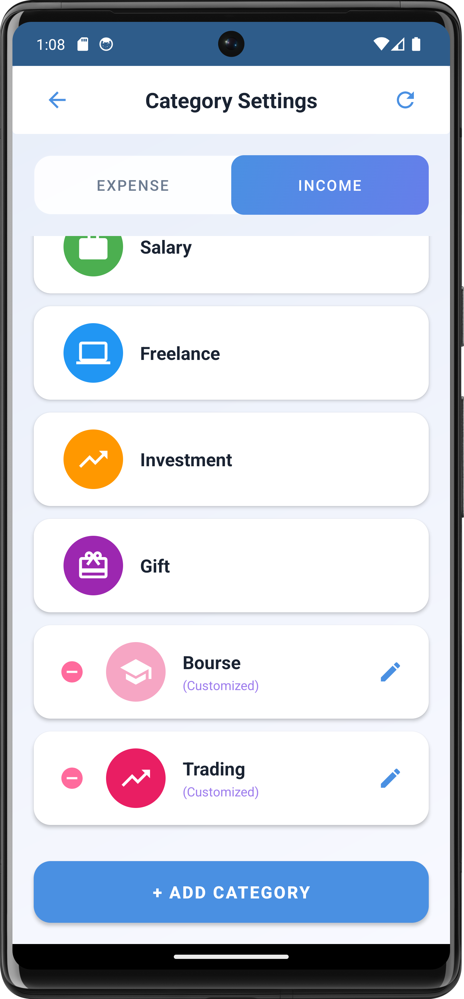
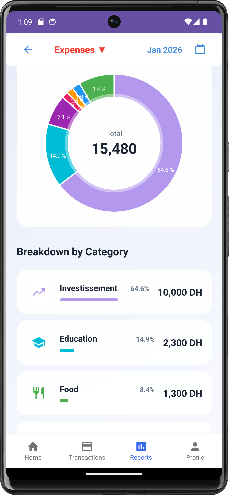
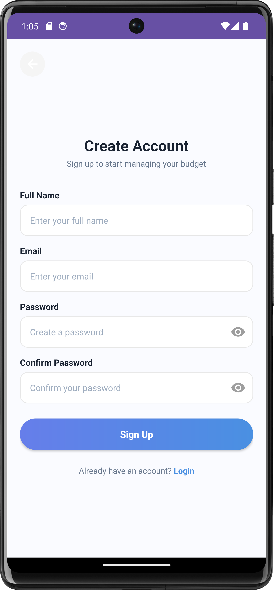

# Fundly — Personal Budget Tracker (Android)

Fundly is a modern Android application that helps you **track expenses & income**, organize them into **custom categories**, and understand your spending using **clear reports and visual breakdowns**.

---

## Key Features

- **Authentication**: Register & Login (cloud-backed)
- **Dashboard**: Total balance + quick overview of recent activity
- **Transactions**
  - Add **Expense** or **Income**
  - Set **date**, **amount**, **category**, and an optional **note**
  - Browse transactions by type (Expense / Income)
- **Category Management**
  - Create categories for **Expense** or **Income**
  - Choose a **custom icon** and a **color**
  - Manage existing categories
- **Reports & Analytics**
  - Monthly view with charts (Expense / Income)
  - Breakdown by category (percentage + total)
- **Profile**
  - View and update user information
  - Logout / session handling

---

## 🖼️ Screenshots

> Stored in `assets/screenshots/`

<table>
  <tr>
    <td align="center"><b>Welcome</b></td>
    <td align="center"><b>Home</b></td>
    <td align="center"><b>Transactions</b></td>
  </tr>
  <tr>
    <td></td>
    <td></td>
    <td></td>
  </tr>
  <tr>
    <td align="center"><b>Add Transaction</b></td>
    <td align="center"><b>Add Category</b></td>
    <td align="center"><b>Categories (Income)</b></td>
  </tr>
  <tr>
    <td></td>
    <td></td>
    <td></td>
  </tr>
  <tr>
    <td align="center"><b>Expense Report</b></td>
    <td align="center"><b>Registration page</b></td>
    <td align="center"><b>Profile page</b></td>
  </tr>
  <tr>
    <td></td>
    <td></td>
    <td></td>
  </tr>
</table>

---

## 🧰 Tech Stack

- **Android Studio**
- **Java**
- **Firebase** (authentication + cloud sync/storage)
- **Realm** (local database / offline persistence)
- **Material Design UI**

## 👥 Team

Academic mobile development project developed by:
- [NadaMesbah](https://github.com/NadaMesbah)
- [ouafaareddame](https://github.com/ouafaareddame)
- [Aaaaam189](https://github.com/Aaaaam189)
